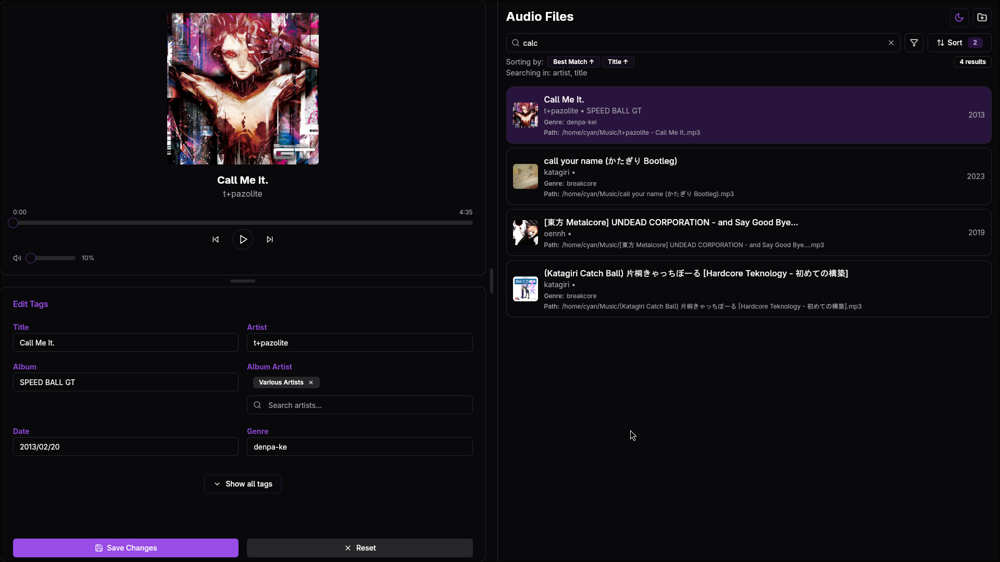

<div align="center">
 

**Taggy - A modern audio tag editor with a beautiful interface.**

[Features](#features) •
[Getting Started](#getting-started) •
[Installation](#installation) •
[Usage](#usage) •
[Contributing](#contributing)

</div>

## ✨ Features

- **Modern UI**: Clean, intuitive interface with light and dark mode support
- **Dual Operation Modes**: Use as a GUI application or via command line
- **Powerful Tagging**: Edit all common audio metadata fields
  - Title, Artist, Album, Album Artist
  - Genre, Year, Track number/total tracks
  - Disc number/total discs, Composer, Comments
  - Album artwork (cover art)
- **Audio Preview**: Listen to your music while you tag it
- **Smart Organization**: 
  - Support for multiple audio directories 
  - Powerful search, filtering, and sorting capabilities
  - Auto-completion from existing tag values
- **File Support**: Works with MP3, FLAC, MP4, M4A audio formats
- **Cross-Platform**: Windows, macOS, and Linux support

## 🖼️ Screenshots

 

## 🚀 Getting Started


### Installation

#### Download Prebuilt Binaries
Download the latest release from the [releases page](https://github.com/Cyanistic/taggy/releases).

#### Build from Source
Building taggy requires npm, cargo, and the dependencies listed for [Tauri](https://tauri.app/v1/guides/getting-started/prerequisites).
```bash
git clone https://github.com/Cyanistic/taggy.git
cd taggy
npm install
npm run tauri build
```


## 🎮 Usage

### GUI Mode

1. Launch the application
2. Add your music directories:
   - Click the folder button in the top-right corner
   - Select "Add Directory" and choose your music folder
   - Or simply drag and drop folders into the application
3. Browse and select audio files from the list
4. Edit metadata in the tag editor panel
5. Save changes with the Save button
6. Preview your audio with the built-in player

#### UI Features

- **Search**: Quickly find files by title, artist, album, or other fields
- **Filtering**: Control which fields are searched with the filter button
- **Sorting**: Multi-criteria sorting with customizable priority
- **Theme Toggle**: Switch between light and dark mode


## 💡 Tips & Tricks

- **Drag and Drop**: Easily add music directories by dragging folders into the app
- **Keyboard Navigation**: Use arrow keys to navigate through your audio files
- **Auto-completion**: Tag inputs show suggestions from your existing collection
- **Resizable Panels**: Adjust the interface layout to your preference
- **Cover Art**: Import artwork from image files or other audio files

## 🔧 Technical Details

Taggy is built with:
- **Tauri**: For cross-platform desktop application framework
- **Rust**: For backend logic and audio file processing
- **SolidJS**: For reactive UI components
- **TailwindCSS**: For styling

## 🤝 Contributing

Contributions are welcome! Please feel free to submit a Pull Request.

## 📜 License

This project is licensed under the GPL-3.0 License - see the LICENSE file for details.
