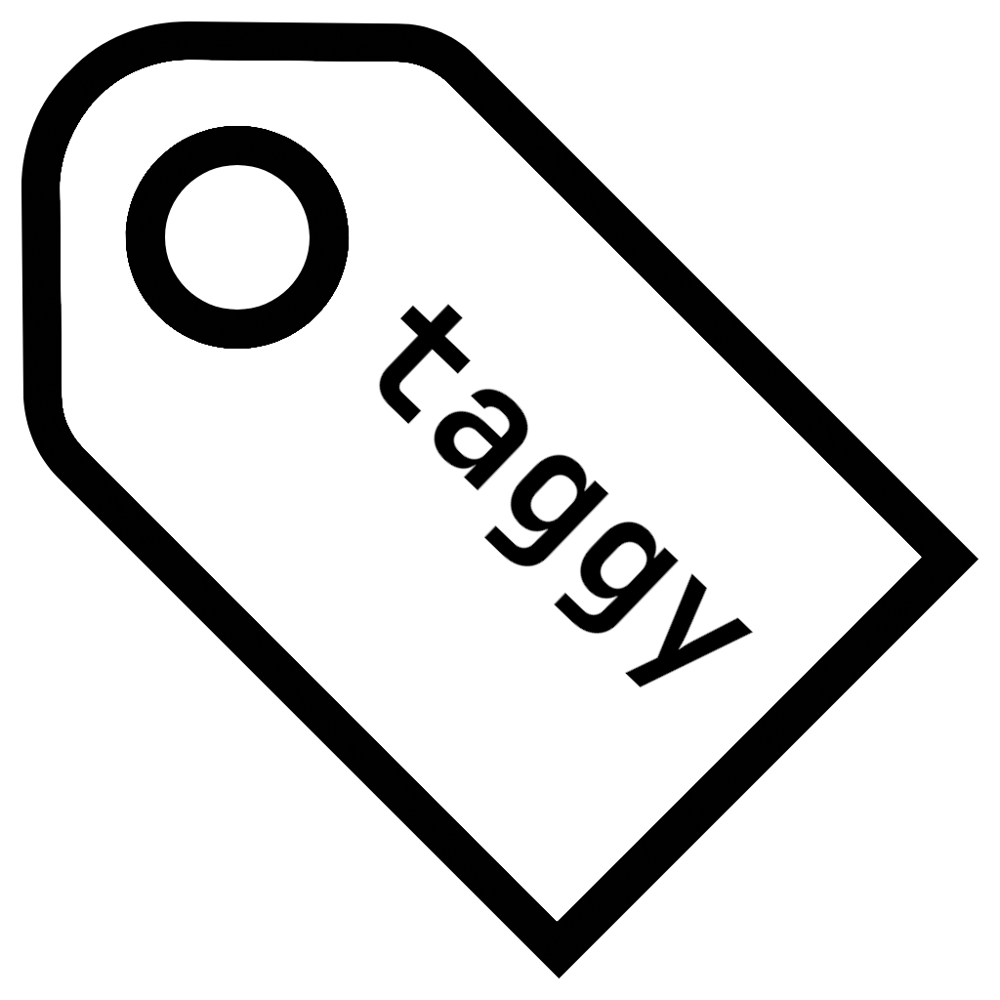

<div align="center">
 

**Taggy - A modern audio tag editor with a beautiful interface.**

[Features](#features) •
[Getting Started](#getting-started) •
[Installation](#installation) •
[Usage](#usage) •
[Contributing](#contributing)

</div>

## ✨ Features

- **Modern UI**: Clean, intuitive interface with light and dark mode support
- **Dual Operation Modes**: Use as a GUI application or via command line
- **Powerful Tagging**: Edit all common audio metadata fields
  - Title, Artist, Album, Album Artist
  - Genre, Year, Track number/total tracks
  - Disc number/total discs, Composer, Comments
  - Album artwork (cover art)
- **Audio Preview**: Listen to your music while you tag it
- **Smart Organization**: 
  - Support for multiple audio directories 
  - Powerful search, filtering, and sorting capabilities
  - Auto-completion from existing tag values
- **File Support**: Works with MP3, FLAC, MP4, M4A audio formats
- **Cross-Platform**: Windows, macOS, and Linux support

## 🖼️ Screenshots

[Screenshots to be added]

## 🚀 Getting Started

### Installation

#### Download Prebuilt Binaries
Download the latest release from the [releases page](https://github.com/Cyanistic/taggy/releases).

#### Build from Source
Building taggy requires npm, cargo, and the dependencies listed for [Tauri](https://tauri.app/v1/guides/getting-started/prerequisites).
```bash
git clone https://github.com/Cyanistic/taggy.git
cd taggy
npm install
npm run tauri build
```


## 🎮 Usage

### GUI Mode

1. Launch the application
2. Add your music directories:
   - Click the folder button in the top-right corner
   - Select "Add Directory" and choose your music folder
   - Or simply drag and drop folders into the application
3. Browse and select audio files from the list
4. Edit metadata in the tag editor panel
5. Save changes with the Save button
6. Preview your audio with the built-in player

#### UI Features

- **Search**: Quickly find files by title, artist, album, or other fields
- **Filtering**: Control which fields are searched with the filter button
- **Sorting**: Multi-criteria sorting with customizable priority
- **Theme Toggle**: Switch between light and dark mode

### Command Line Mode

Taggy provides a powerful CLI for quick editing and batch operations:

```
A simple audio tag manipulator. Running with no arguments opens GUI.
Note that argument order is respected.

Usage: taggy [OPTIONS]

OPTIONS:
-h, --help                           Print the help information.
-V, --version                        Print the version information.
-r, --dry-run                        Modifications to all files are discarded after execution.
                                     In most cases, this should be the first argument if you plan to use it, as it only applies to arguments provided after it.
--                                   Passes all arguments to the GUI version and runs it.
-f, --file          [FILE]           Sets the file to modify, this should be provided before the desired modifications.
                                     Multiple files can be modified in the same command.
-t, --title         [TITLE]          Sets the new title for the provided audio file.
-a, --artist        [ARTIST]         Sets the new artist for the provided audio file.
-c, --cover         [FILE]           Sets the new cover for the provided audio file.
                                     This can either be an image file or another audio file with a cover
-e, --extract-cover [FILE]           Extract the cover of the provided audio file into FILE.
                                     If FILE is - the cover data is printed to stdout.
-T, --album-title   [ALBUM TITLE]    Sets the new album title for the provided audio file.
-A, --album-artist  [ALBUM ARTIST]   Sets the new album artist for the provided audio file.
-y, --year          [YEAR]           Sets the new year for the provided audio file.
-g, --genre         [GENRE]          Sets the new genre for the provided audio file.
-d, --disc-number   [DISC NUMBER]    Sets the new disc number for the provided audio file.
-D, --total-discs   [TOTAL DISCS]    Sets the new total discs for the provided audio file.
-n, --track-number  [TRACK NUMBER]   Sets the new track number for the provided audio file.
-R, --total-tracks  [TOTAL TRACKS]   Sets the new total tracks for the provided audio file.
-p, --print                          Prints all tags of the provided file.
```

#### Example Commands

```bash
# Print all metadata for a file
taggy -f song.mp3 -p

# Set title and artist
taggy -f song.mp3 -t "New Title" -a "New Artist"

# Set album art from an image
taggy -f song.mp3 -c cover.jpg

# Extract album art
taggy -f song.mp3 -e extracted_cover.jpg

# Batch update multiple files
taggy -f song1.mp3 -t "Song 1" -f song2.mp3 -t "Song 2"
```

## 💡 Tips & Tricks

- **Drag and Drop**: Easily add music directories by dragging folders into the app
- **Keyboard Navigation**: Use arrow keys to navigate through your audio files
- **Auto-completion**: Tag inputs show suggestions from your existing collection
- **Resizable Panels**: Adjust the interface layout to your preference
- **Cover Art**: Import artwork from image files or other audio files

## 🔧 Technical Details

Taggy is built with:
- **Tauri**: For cross-platform desktop application framework
- **Rust**: For backend logic and audio file processing
- **SolidJS**: For reactive UI components
- **TailwindCSS**: For styling

## 🤝 Contributing

Contributions are welcome! Please feel free to submit a Pull Request.

## 📜 License

This project is licensed under the GPL-3.0 License - see the LICENSE file for details.
